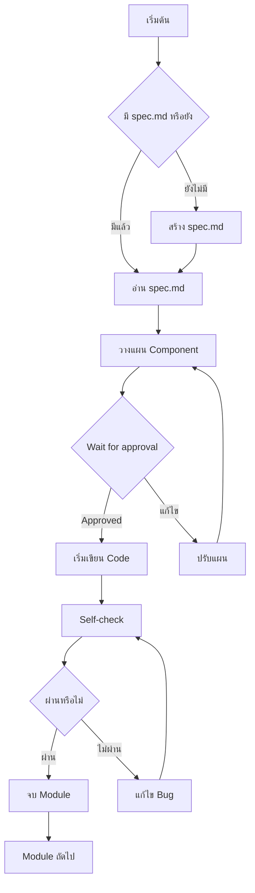
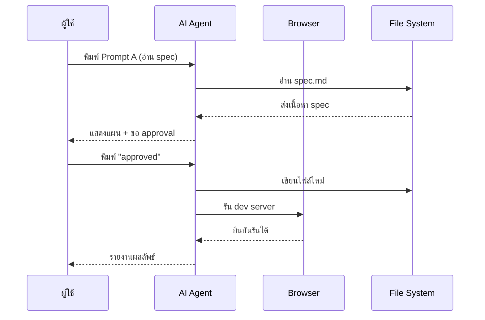
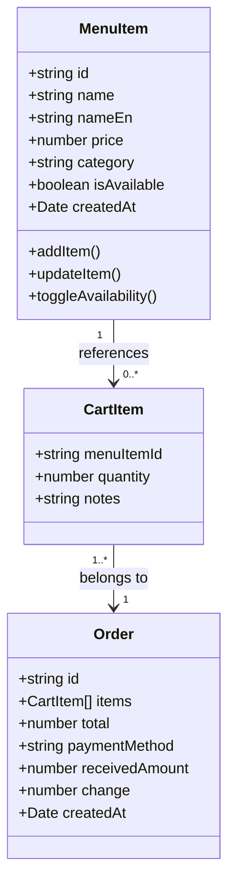
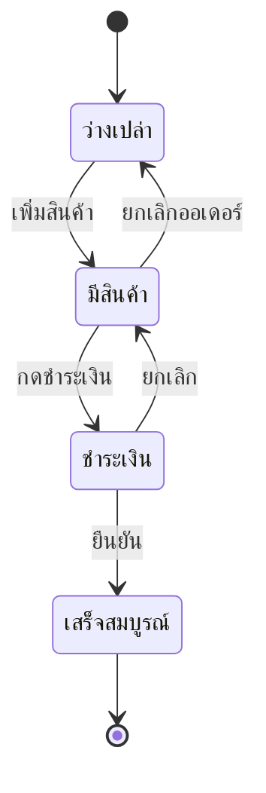
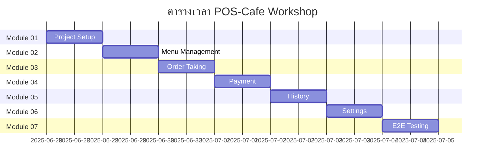

# Heading 1 — หัวข้อใหญ่สุด
## Heading 2 — หัวข้อรอง
### Heading 3 — หัวข้อย่อย
#### Heading 4 — ระดับลึก
##### Heading 5 — ลึกกว่านั้น
###### Heading 6 — ระดับสุดท้าย

---

## Paragraphs & Text Formatting

นี่คือย่อหน้าปกติที่มีข้อความภาษาไทยและภาษาอังกฤษสลับกัน สามารถมี **ตัวหนา (bold)**, *ตัวเอียง (italic)*, ***ตัวหนาและเอียงพร้อมกัน***, ~~ขีดฆ่า (strikethrough)~~, ==ไฮไลท์ (highlight)==, และ `inline code` อยู่ในประโยคเดียวกันได้

อีกย่อหน้าหนึ่งที่มี superscript: x^2^ + y^2^ = z^2^ และ subscript: H~2~O รวมถึง <u>ขีดเส้นใต้ด้วย HTML</u>

## Lists

### Unordered List
- รายการแรก
- รายการที่สองที่มี **ตัวหนา** อยู่ข้างใน
  - รายการย่อยระดับ 1
    - รายการย่อยระดับ 2
    - อีกรายการย่อย
  - กลับมาระดับ 1
- รายการสุดท้าย

### Ordered List
1. ขั้นตอนที่หนึ่ง
2. ขั้นตอนที่สองที่มี `code` ประกอบ
   1. ขั้นตอนย่อย 2.1
   2. ขั้นตอนย่อย 2.2
3. ขั้นตอนที่สาม
4. ขั้นตอนสุดท้าย

### Task List
- [x] ทำงานที่เสร็จแล้ว
- [ ] งานที่ยังไม่เสร็จ
- [x] ตรวจสอบ AGENTS.md
- [ ] อัปเดต SKILL.md

---

## Links

[Link ปกติ](https://example.com) | [Link ที่มี title](https://example.com "หัวข้อลิงก์") | [Link ภายใน](#heading-1--หัวข้อใหญ่สุด)

Autolink: <https://example.com> และอีเมล <pok@example.com>

Reference-style link: [AGENTS docs][1] และ [SKILL guide][2]

[1]: https://docs.anthropic.com "เอกสาร AGENTS"
[2]: https://docs.thclaws.com "คู่มือ SKILL"

---

## Images


Reference-style image: ![Logo ตัวอย่าง][logo]

[logo]: https://via.placeholder.com/200x100/4A5568/FFFFFF?text=Logo "Logo ตัวอย่าง"

---

## Code Blocks

### Inline Code
ใช้ `pnpm install` เพื่อติดตั้ง dependencies และรัน `npm run dev` เพื่อเปิด dev server

### Fenced Code Block (ไม่ระบุภาษา)
```
นี่คือ code block ที่ไม่ระบุภาษา
สามารถมีข้อความอะไรก็ได้ข้างใน
```

### TypeScript
```typescript
import { useState } from 'react';

interface MenuItem {
  id: string;
  name: string;
  price: number;
  category: 'coffee' | 'tea' | 'bakery';
  isAvailable: boolean;
}

const [items, setItems] = useState<MenuItem[]>([]);

// Filter แสดงเฉพาะเมนูที่เปิดขาย
const availableItems = items.filter(item => item.isAvailable);
```

### Rust
```rust
use std::fs;

fn main() {
    let contents = fs::read_to_string("AGENTS.md")
        .expect("Should have been able to read the file");
    
    println!("File content: {}", contents);
}
```

### Bash / Shell
```bash
#!/bin/bash
cd ~/development/thclaws/
pnpm install
git add .
git commit -m "update: SKILL.md"
```

### JSON
```json
{
  "id": "sess-7a3c1f9d",
  "title": "POS-Cafe Workshop",
  "status": "active",
  "modules": ["01", "02", "03", "04", "05", "06", "07"],
  "metadata": {
    "author": "Pok",
    "createdAt": "2025-06-28T10:00:00Z"
  }
}
```

### YAML
```yaml
---
agent:
  name: thClaws
  version: "1.0.0"
  permissions:
    - read
    - write
    - execute
  skills:
    - chapter-writer
    - testing-safe-runner
```

### SQL
```sql
SELECT 
  menu_items.name,
  menu_items.price,
  categories.name AS category
FROM menu_items
JOIN categories ON menu_items.category_id = categories.id
WHERE menu_items.is_available = TRUE
ORDER BY menu_items.created_at DESC;
```

---

## Tables

### Table ปกติ
| ชื่อเมนู | ราคา (บาท) | หมวดหมู่ | สถานะ |
|---|---|---|---|
| เอสเปรสโซ่ | 65 | กาแฟ | ✅ |
| ลาเต้ | 85 | กาแฟ | ✅ |
| ชาไทย | 60 | ชา | ✅ |
| ครัวซองต์ | 55 | เบเกอรี่ | ❌ |
| มอคค่า | 95 | กาแฟ | ✅ |

### Table ที่มี Alignment
| ฟีเจอร์ | Module 01 | Module 02 | Module 03 |
|:---|:---:|:---:|---:|
| Project Setup | ✅ | — | — |
| Menu CRUD | — | ✅ | — |
| Order Taking | — | — | ✅ |
| Total Hours | 1 | 2 | 3 |

---

## Blockquotes

> นี่คือ blockquote ปกติที่มีข้อความภาษาไทย
> สามารถมีหลายบรรทัดได้โดยใช้ `>` นำหน้า

> **Blockquote ที่มีตัวหนา**
> 
> มี *ตัวเอียง* และ `inline code` อยู่ข้างในได้
> 
> > นี่คือ blockquote ซ้อนกัน (nested blockquote)
> > 
> > > ซ้อนลงไปอีกชั้น

---

## Math

### Inline Math
สมการพีทาโกรัส: $a^2 + b^2 = c^2$

ฟังก์ชันการคำนวณเงินทอน: $change = received - total$

### Block Math
$$
E = mc^2
$$

### สมการซับซ้อน
$$
\sigma(x) = \frac{1}{1 + e^{-x}} \quad \text{where} \quad x \in \mathbb{R}
$$

### Matrix และ Summation
$$
\begin{bmatrix}
a & b \\
c & d
\end{bmatrix}
\times
\begin{bmatrix}
e & f \\
g & h
\end{bmatrix}
=
\begin{bmatrix}
ae+bg & af+bh \\
ce+dg & cf+dh
\end{bmatrix}
$$

$$
\sum_{i=1}^{n} x_i = x_1 + x_2 + \cdots + x_n
$$

---

## Mermaid Charts

### Flowchart


### Sequence Diagram


### Class Diagram


### State Diagram


### Gantt Chart


---

## Footnotes

นี่คือข้อความที่มี footnote[^1] อยู่ข้างใน สามารถมี footnote หลายอัน[^2] และอ้างอิงซ้ำ[^1] ได้

อีกย่อหน้าที่มี footnote ระยะยาว[^longnote]

[^1]: นี่คือ footnote แรกที่อธิบายเพิ่มเติม
[^2]: Footnote ที่สอง
[^longnote]: นี่คือ footnote ที่มีเนื้อหายาวมากกว่าปกติ สามารถมีหลายบรรทัดได้ แล้วก็มี `code` อยู่ข้างในได้ด้วย

---

## HTML ภายใน Markdown

<div style="padding: 1rem; background: #FDF6EC; border-left: 4px solid #6F4E37; margin: 1rem 0;">
<strong>💡 Tip:</strong> นี่คือ callout block ที่ใช้ HTML สร้าง สามารถใช้ได้ใน Markdown editor ที่รองรับ HTML rendering
</div>

<table>
  <tr>
    <td><b>HTML Table</b></td>
    <td>ผสมกับ Markdown</td>
  </tr>
  <tr>
    <td>แถว 1</td>
    <td>ค่า 1</td>
  </tr>
</table>

---

## Emoji และ Special Characters

✅ ❌ ❓ 💡 ⚠️ 📝 🚀 🎯 🧪 ☕ 🍰 📊 💰 📄 🔧 ⚙️ 🧹

ลูกศร: → ← ↑ ↓ ↔ ↕ ⇒ ⇐ ⇔ • ◦ ◆ ▪ ▫

อักษรพิเศษ: α β γ δ ε θ λ π σ τ φ ω ∞ ∑ ∫ ∂ √ ≈ ≠ ≤ ≥ ±

---

## Definition List

Term 1
:   คำจำกัดความของ Term 1 ที่อธิบายความหมาย

Term 2
:   คำจำกัดความแรกของ Term 2
:   คำจำกัดความที่สองของ Term 2

---

## Collapsible Section (Details)

<details>
<summary>คลิกเพื่อดูรายละเอียดเพิ่มเติม</summary>

นี่คือเนื้อหาที่ซ่อนอยู่ข้างใน `<details>` tag

- สามารถมี list ได้
- **ตัวหนา** และ *ตัวเอียง* ก็ใช้ได้
- `code` ก็ใช้ได้

```javascript
console.log("Hello from inside details!");
```

</details>

---

## Line Breaks & Horizontal Rules

นี่คือบรรทัดแรก  
นี่คือบรรทัดที่สอง (hard break ด้วย 2 spaces)

นี่คือย่อหน้าใหม่

---

***

___

---

## Escaped Characters

\* ดอกจันที่ไม่ใช่ italic \*
\` backtick ที่ไม่ใช่ code \`
\# hash ที่ไม่ใช่ heading
\[ bracket ที่ไม่ใช่ link \]
\| pipe ที่ไม่ใช่ table \|

---

## สรุป

ไฟล์นี้รวม syntax Markdown ที่พบได้ทั่วไปทั้งหมด รวมถึง:

- [x] Headers, paragraphs, text formatting
- [x] Lists (unordered, ordered, task)
- [x] Links (inline, reference, autolinks)
- [x] Images (inline, reference)
- [x] Code (inline, fenced blocks หลายภาษา)
- [x] Tables (alignment)
- [x] Blockquotes (nested)
- [x] Math (inline และ block)
- [x] Mermaid diagrams (flowchart, sequence, class, state, gantt)
- [x] Footnotes
- [x] HTML blocks
- [x] Emoji และ special characters
- [x] Definition lists
- [x] Collapsible sections
- [x] Escaped characters

ใช้ไฟล์นี้ทดสอบ Markdown renderer ได้ครบถ้วน 🎯
