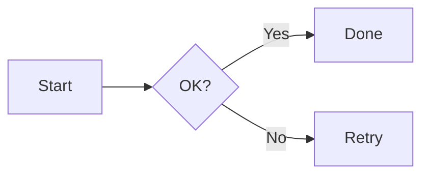

# Markdown Features Test

เอกสารทดสอบ preview engine ครบถ้วน

## Text Formatting

**Bold**, *italic*, ~~strikethrough~~, and `inline code`.

## Lists

- Item one
- Item two
  - Nested item
- การใช้งาน
- ทดสอบแก้ไขแล้ว saved

1. First
2. Second

- [x] Done task
- [ ] Pending task

## Table

| Name | Value |
|------|------:|
| Alpha | 1 |
| Beta | 2 |

## Code Block

```python
def greet(name: str) -> str:
    return f"Hello, {name}!"
```

## Blockquote

> This is a blockquote.
> Second line.

## GitHub Alerts

> [!NOTE]
> This is a note alert.

> [!WARNING]
> Be careful with this.

## Math

Inline: $E = mc^2$

Block:

$$
\int_0^\infty e^{-x^2} dx = \frac{\sqrt{\pi}}{2}
$$

## Mermaid



## Link & Image

[MD Editor](https://example.com)


## Horizontal Rule

---

## Footnote

Here is a footnote reference[^1].

[^1]: Footnote content here.
