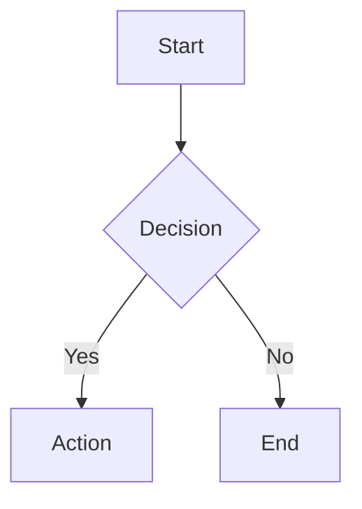
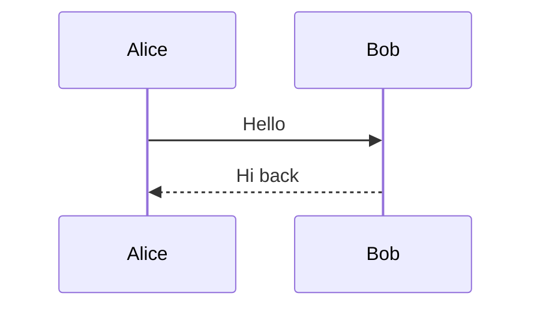
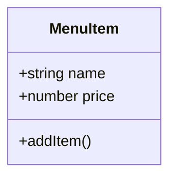
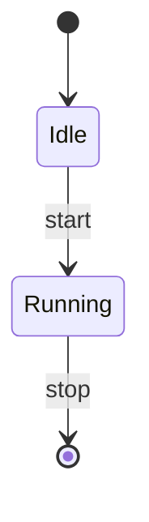
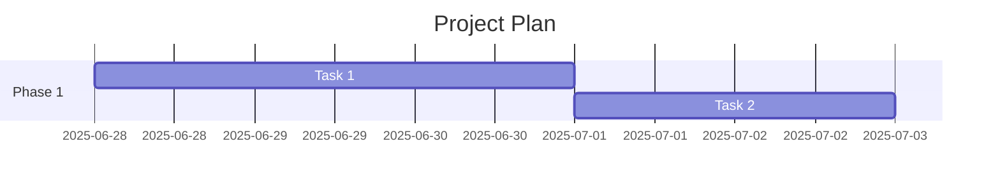

# Markdown Syntax Reference

ไฟล์อ้างอิงนี้แสดง tag ทั้งหมดของ Markdown ที่รองรับ แบ่งตามหมวดหมู่พร้อมตัวอย่างใช้งาน

---

## 1. หัวข้อ (Headings)

ใช้ `#` นำหน้า 1–6 อัน

| Markdown | ผลลัพธ์ |
|---|---|
| `# Heading 1` | <h1>Heading 1</h1> |
| `## Heading 2` | <h2>Heading 2</h2> |
| `### Heading 3` | <h3>Heading 3</h3> |
| `#### Heading 4` | <h4>Heading 4</h4> |
| `##### Heading 5` | <h5>Heading 5</h5> |
| `###### Heading 6` | <h6>Heading 6</h6> |

---

## 2. ข้อความ (Text Formatting)

| Markdown | ผลลัพธ์ | คำอธิบาย |
|---|---|---|
| `**bold**` | **bold** | ตัวหนา |
| `*italic*` | *italic* | ตัวเอียง |
| `***bold italic***` | ***bold italic*** | หนา + เอียง |
| `~~strikethrough~~` | ~~strikethrough~~ | ขีดฆ่า |
| `==highlight==` | ==highlight== | ไฮไลท์ |
| `` `code` `` | `code` | inline code |
| `H~2~O` | H~2~O | subscript |
| `x^2^` | x^2^ | superscript |
| `<u>underline</u>` | <u>underline</u> | ขีดเส้นใต้ (HTML) |

---

## 3. รายการ (Lists)

### 3.1 รายการแบบไม่เรียงลำดับ

```markdown
- รายการ 1
- รายการ 2
  - ย่อย 1
  - ย่อย 2
- รายการ 3
```

**ผลลัพธ์:**
- รายการ 1
- รายการ 2
  - ย่อย 1
  - ย่อย 2
- รายการ 3

### 3.2 รายการแบบเรียงลำดับ

```markdown
1. ขั้นตอน 1
2. ขั้นตอน 2
   1. ย่อย 2.1
   2. ย่อย 2.2
3. ขั้นตอน 3
```

**ผลลัพธ์:**
1. ขั้นตอน 1
2. ขั้นตอน 2
   1. ย่อย 2.1
   2. ย่อย 2.2
3. ขั้นตอน 3

### 3.3 รายการงาน (Task Lists)

```markdown
- [x] เสร็จแล้ว
- [ ] ยังไม่เสร็จ
- [x] ตรวจสอบแล้ว
```

**ผลลัพธ์:**
- [x] เสร็จแล้ว
- [ ] ยังไม่เสร็จ
- [x] ตรวจสอบแล้ว

---

## 4. ลิงก์ (Links)

| Markdown | ผลลัพธ์ |
|---|---|
| `[ข้อความ](https://example.com)` | [ข้อความ](https://example.com) |
| `[ข้อความ](https://example.com "title")` | [ข้อความ](https://example.com "title") |
| `<https://example.com>` | <https://example.com> |
| `[ref][1]` แล้วตามด้วย `[1]: https://example.com` | [ref][1] |

[1]: https://example.com

---

## 5. รูปภาพ (Images)

| Markdown | ผลลัพธ์ |
|---|---|
| `` |  |
| `` |  |

---

## 6. โค้ด (Code)

### 6.1 Inline Code

```markdown
ใช้ `pnpm install` เพื่อติดตั้ง
```

**ผลลัพธ์:** ใช้ `pnpm install` เพื่อติดตั้ง

### 6.2 Code Block

ใช้ ``` สามอันพร้อมระบุภาษา

**markdown:**
<pre><code>```typescript
const x = 1;
```</code></pre>

**ผลลัพธ์:**
```typescript
const x = 1;
```

---

## 7. ตาราง (Tables)

### 7.1 ตารางปกติ

```markdown
| ชื่อ | ราคา | สถานะ |
|---|---|---|
| กาแฟ | 65 | ✅ |
| ชา | 60 | ✅ |
```

**ผลลัพธ์:**
| ชื่อ | ราคา | สถานะ |
|---|---|---|
| กาแฟ | 65 | ✅ |
| ชา | 60 | ✅ |

### 7.2 จัดชิด (Alignment)

```markdown
| ชิดซ้าย | กึ่งกลาง | ชิดขวา |
|:---|:---:|:---:|---:|
| A | B | C | D |
```

**ผลลัพธ์:**
| ชิดซ้าย | กึ่งกลาง | ชิดขวา |
|:---|:---:|:---:|---:|
| A | B | C | D |

---

## 8. อ้างอิงบล็อก (Blockquotes)

```markdown
> นี่คือ blockquote
> 
> > blockquote ซ้อนกัน
```

**ผลลัพธ์:**
> นี่คือ blockquote
> 
> > blockquote ซ้อนกัน

---

## 9. เส้นคั่น (Horizontal Rules)

| Markdown | ผลลัพธ์ |
|---|---|
| `---` | — |
| `***` | — |
| `___` | — |

---

## 10. สมการคณิตศาสตร์ (Math)

### 10.1 Inline Math

```markdown
พีทาโกรัส: $a^2 + b^2 = c^2$
```

**ผลลัพธ์:** พีทาโกรัส: $a^2 + b^2 = c^2$

### 10.2 Block Math

<pre>$$
E = mc^2
$$</pre>

**ผลลัพธ์:**
$$
E = mc^2
$$

### 10.3 สมการซับซ้อน

<pre>$$
\sigma(x) = \frac{1}{1 + e^{-x}}
$$</pre>

**ผลลัพธ์:**
$$
\sigma(x) = \frac{1}{1 + e^{-x}}
$$

### 10.4 Matrix

<pre>$$
\begin{bmatrix}
a & b \\
c & d
\end{bmatrix}
$$</pre>

**ผลลัพธ์:**
$$
\begin{bmatrix}
a & b \\
c & d
\end{bmatrix}
$$

### 10.5 Summation

<pre>$$
\sum_{i=1}^{n} x_i
$$</pre>

**ผลลัพธ์:**
$$
\sum_{i=1}^{n} x_i
$$

---

## 11. Mermaid Diagrams

### 11.1 Flowchart

<pre><code>```mermaid
flowchart TD
    A[Start] --> B{Decision}
    B -->|Yes| C[Action]
    B -->|No| D[End]
```</code></pre>

**ผลลัพธ์:**


### 11.2 Sequence Diagram

<pre><code>```mermaid
sequenceDiagram
    Alice->>Bob: Hello
    Bob-->>Alice: Hi back
```</code></pre>

**ผลลัพธ์:**


### 11.3 Class Diagram

<pre><code>```mermaid
classDiagram
    class MenuItem {
        +string name
        +number price
        +addItem()
    }
```</code></pre>

**ผลลัพธ์:**


### 11.4 State Diagram

<pre><code>```mermaid
stateDiagram-v2
    [*] --> Idle
    Idle --> Running : start
    Running --> [*] : stop
```</code></pre>

**ผลลัพธ์:**


### 11.5 Gantt Chart

<pre><code>```mermaid
gantt
    title Project Plan
    section Phase 1
    Task 1 :a1, 2025-06-28, 3d
    Task 2 :after a1, 2d
```</code></pre>

**ผลลัพธ์:**


---

## 12. อ้างอิงล่างหน้า (Footnotes)

```markdown
ข้อความมี footnote[^1] อยู่ข้างใน

[^1]: นี่คือเนื้อหา footnote
```

**ผลลัพธ์:** ข้อความมี footnote[^1] อยู่ข้างใน

[^1]: นี่คือเนื้อหา footnote

---

## 13. รายการนิยาม (Definition Lists)

```markdown
Term
:   คำจำกัดความ

Term 2
:   ความหมายแรก
:   ความหมายที่สอง
```

**ผลลัพธ์:**
Term
:   คำจำกัดความ

Term 2
:   ความหมายแรก
:   ความหมายที่สอง

---

## 14. ส่วนพับเก็บได้ (Collapsible Sections)

```html
<details>
<summary>คลิกเพื่อดู</summary>
เนื้อหาที่ซ่อนอยู่
</details>
```

**ผลลัพธ์:**
<details>
<summary>คลิกเพื่อดู</summary>
เนื้อหาที่ซ่อนอยู่
</details>

---

## 15. HTML ภายใน Markdown

```html
<div style="padding: 1rem; background: #FDF6EC;">
  HTML block ที่มี **Markdown** ข้างใน
</div>
```

**ผลลัพธ์:**
<div style="padding: 1rem; background: #FDF6EC;">
  HTML block ที่มี **Markdown** ข้างใน
</div>

---

## 16. อักขระพิเศษ (Special Characters)

| Markdown | ผลลัพธ์ |
|---|---|
| `\*` | * (literal asterisk) |
| `\` | \ (backtick) |
| `\#` | # (literal hash) |
| `\[` | [ (literal bracket) |
| `\|` | \| (literal pipe) |

---

## 17. Emoji

พิมพ์ emoji โดยตรงได้เลย: ✅ ❌ 💡 ⚠️ 📝 🚀 🎯 🧪 ☕ 📊 💰 🔧 ⚙️

หรือใช้ shortcode `:smile:` (ถ้า renderer รองรับ)

---

## สรุปตาราง Tag ทั้งหมด

| หมวดหมู่ | Tag หลัก | ไฟล์ตัวอย่าง |
|---|---|---|
| หัวข้อ | `#` ถึง `######` | [sample.md](sample.md) |
| ตัวหนา | `**text**` | [sample.md](sample.md) |
| ตัวเอียง | `*text*` | [sample.md](sample.md) |
| ขีดฆ่า | `~~text~~` | [sample.md](sample.md) |
| ไฮไลท์ | `==text==` | [sample.md](sample.md) |
| Inline code | `` `code` `` | [sample.md](sample.md) |
| Code block | ` ```lang ` | [sample.md](sample.md) |
| ลิงก์ | `[text](url)` | [sample.md](sample.md) |
| รูปภาพ | `` | [sample.md](sample.md) |
| รายการ | `-` / `1.` / `- [ ]` | [sample.md](sample.md) |
| ตาราง | `\| col \| col \|` | [sample.md](sample.md) |
| อ้างอิง | `> quote` | [sample.md](sample.md) |
| เส้นคั่น | `---` / `***` | [sample.md](sample.md) |
| Math inline | `$...$` | [sample.md](sample.md) |
| Math block | `$$...$$` | [sample.md](sample.md) |
| Mermaid | ` ```mermaid ` | [sample.md](sample.md) |
| Footnote | `[^n]` / `[^n]: text` | [sample.md](sample.md) |
| Details | `<details>` | [sample.md](sample.md) |
| HTML | `<div>` / `<table>` | [sample.md](sample.md) |
| Subscript | `H~2~O` | [sample.md](sample.md) |
| Superscript | `x^2^` | [sample.md](sample.md) |
| Emoji | `✅` / `☕` | [sample.md](sample.md) |

---

*เอกสารนี้อัปเดตล่าสุด: 2025-06-28*
